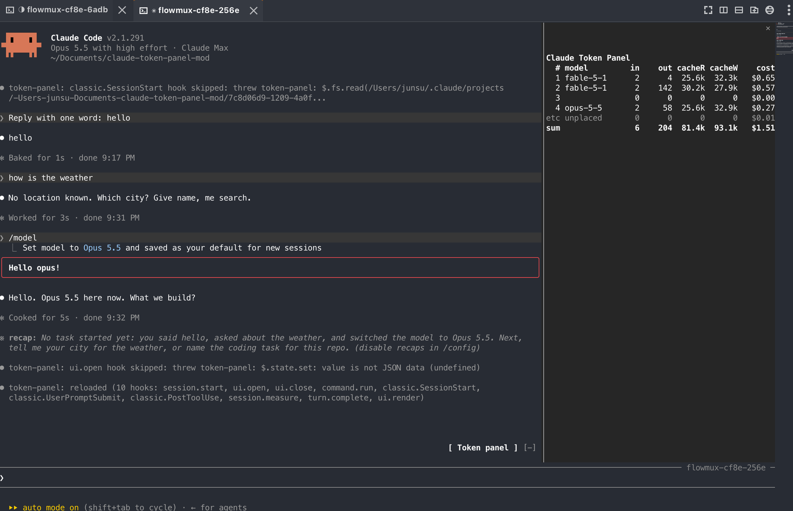

# claude-token-panel

A Claude Code mod that shows, for every prompt of the session, how many tokens it used and what it cost.



## Install

Requires Claude Code 2.1.287 or newer.

```
/plugin install token-panel --marketplace flowmux-ai/claude-token-panel
```

## Use

`/token-panel` shows or hides the pane.

## What is counted

- Every prompt of the session, read from its transcript file.
- Subagent and advisor calls count toward the prompt that made them, priced at their own model.
- Internal calls with no transcript row (web search, title generation) add to `cost` only.
- The `sum` row matches `/cost`. Cost not tied to any prompt shows as `etc unplaced`.

## Cost

Tokens times the standard [API rates](https://platform.claude.com/docs/en/about-claude/pricing). The rate table lives in `hooks/tally.ts` and is updated by hand. A model missing from it shows `?` instead of `$`.

## Develop

```
claude --plugin-dir .        # run the mod from this folder, reloading on save
claude plugin validate .
claude plugin test .
```

## License

[MIT](LICENSE)
